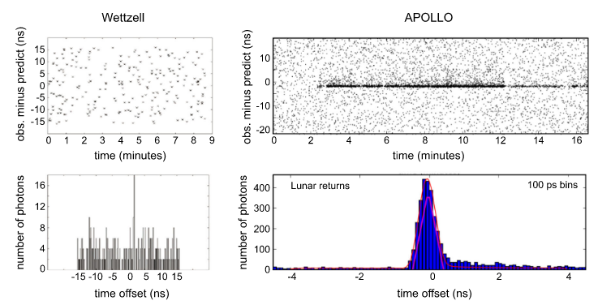

**Задача 2**: первичная обработка наблюдений лазерной локации Луны. Дано некоторое количество точек на интервале времени в один сеанс наблюдений (~10 минут). Каждая точка — это разность между наблюдённым и модельным значением времени хода лазерного луча от обсерватории до ретрорефлектора на Луне и обратно. 

Есть две проблемы: 
1. данных за сеанс накапливается довольно много, и в научной обработке они не нужны в таком количестве. Достаточно одного псевдо-наблюдения на сеанс. 
2. В телескоп попадают не только фотоны, отражённые от ретрорефлектора, но и большое количество других фотонов, которые отразились от лунного грунта. Требуется исключить из обработки лишние зашумляющие фотоны.

**Методика решения**: подогнать под точки полином (на практике хватает степени не выше 3). Вычесть полином из точек. Посчитать rms точек. Откинуть точки-выбросы (т. е. те, значения которых по модулю больше 3 rms). Повторять с первого шага до тех пор, пока выбросов не останется. Убедиться в том, что степень полинома выбрана правильно, и аргументированно убедить в этом преподавателя. Сформировать нормальную точку следующим образом: на интервале времени выбрать момент, кратный секунде и ближайший к середине, и выдать: момент времени, значение полинома в нём и rms. Построить график с полиномом, отброшенными точками и оставшимися точками.

Исходные данные будут выданы преподавателем по запросу.